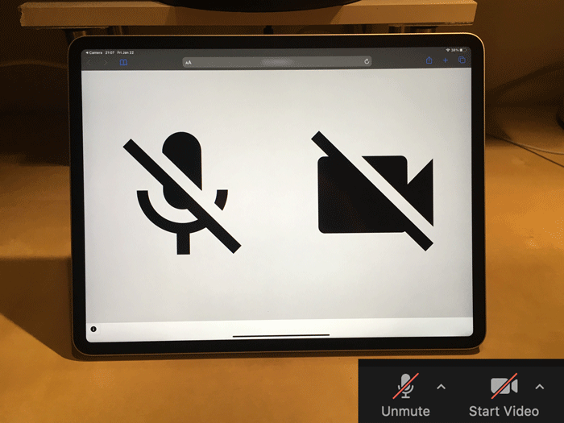

# zoom-status-display

Display your Zoom's mute/unmute status on other devices such as smartphone and tablet.

## Installing

1. Download the latest [release](https://github.com/FlechaMaker/zoom-status-display/releases)
2. [Allow zoom-mute-status-server (this app) to access accessibility feature](https://support.apple.com/guide/mac-help/allow-accessibility-apps-to-access-your-mac-mh43185/11.0/mac/11.0)
3. [Allow zoom-mute-status-server (this app) to receive incoming connections](https://support.apple.com/HT201642)

## How to use

1. Launch zoom-mute-status-server
2. Click the icon in your menubar
3. Scan QR code to access client page
